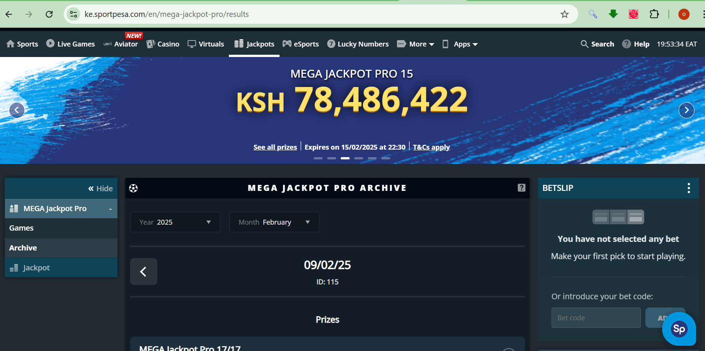

# 📊 SportPesa Jackpot Scraper



## 📝 Project Overview
This project is a **web scraping script** designed to collect historical **SportPesa jackpot data** using Python. The script:

- Retrieves **jackpot archives** for specified months and years.
- Extracts **jackpot event details**, including kickoff time, teams, and results.
- **Handles failed requests** efficiently by tracking unsuccessful headers and requests.
- Saves the scraped data into a CSV file (**hist_jackport17.csv**).
- Logs failed timestamps and jackpots in JSON files for debugging.

## ⚡ Features
- **Rotating Headers:** Uses `fake_useragent` to generate dynamic User-Agent headers.
- **Avoids Duplicate Requests:** Skips already scraped jackpot IDs.
- **Retries Failed Requests:** Automatically retries requests up to 10 times with different headers.
- **Failed Request Logging:** Stores failed timestamp and jackpot URLs for later review.
- **Rate Limiting:** Adds random delays between requests to avoid blocking.

---

## 🚀 Installation & Setup
### **1️⃣ Clone the Repository**
```sh
$ https://github.com/Ochoka/sportpesa-jackpot-scraper.git
$ cd sportpesa-jackpot-scraper
```

### **2️⃣ Install Required Packages**
Ensure you have Python installed (version 3.7+ recommended). Install dependencies:
```sh
$ pip install requests tqdm fake_useragent pandas
```

---

## 🛠️ How to Use
### **Run the Script**
```sh
$ python scraper.py
```

### **Customize the Time Range**
Edit these lines in `scraper.py` to adjust the scraping period:
```python
start_year, end_year = 2022, 2024
start_month, end_month = 12, 2
```

This will scrape jackpot archives from **December 2022 to February 2024**.

---

## 📂 Output Files
1. **Scraped Data**
   - `hist_jackport17.csv`: Contains all successfully scraped jackpot event details.

2. **Error Logging**
   - `failed_timestamps.json`: Stores failed timestamp URLs.
   - `failed_jackpots.json`: Stores failed jackpot URLs.

---

## 🔍 Handling Failed Requests
- **Failed Headers:** If a User-Agent header fails, it is stored in a `set` and not reused.
- **Failed Requests:** If a timestamp or jackpot request fails after 10 attempts, it is logged for later review.

---

## 📜 License
This project is open-source and available under the **MIT License**.

---

## 🙌 Contributing
Feel free to submit pull requests to improve the script!

1. Fork the repo
2. Create a feature branch (`git checkout -b feature-new`)
3. Commit changes (`git commit -m "Added new feature"`)
4. Push to your branch (`git push origin feature-new`)
5. Open a Pull Request 🚀

---

## 💡 Future Improvements
- Implement proxy support to improve request reliability.
- Store scraped data in a database instead of CSV.
- Add support for real-time scraping instead of just historical data.

---

## 📧 Contact
For any issues, please open an issue on the GitHub repository or contact me at `ochoka2018@gmail.com`.

Happy Scraping! 🎯🚀

